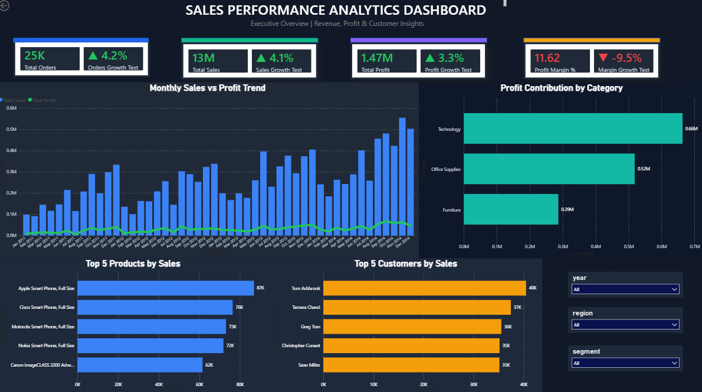
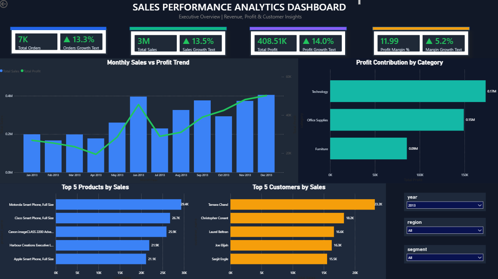
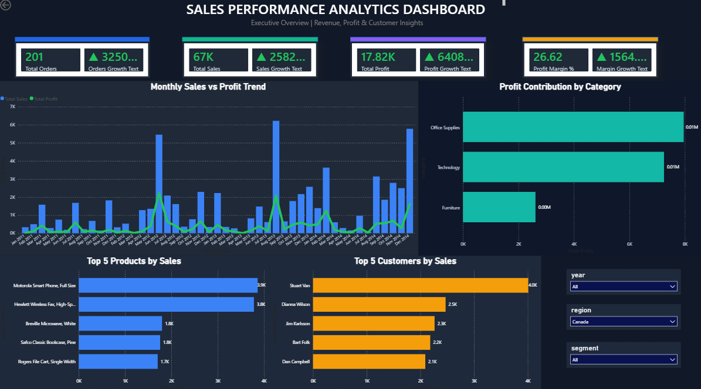
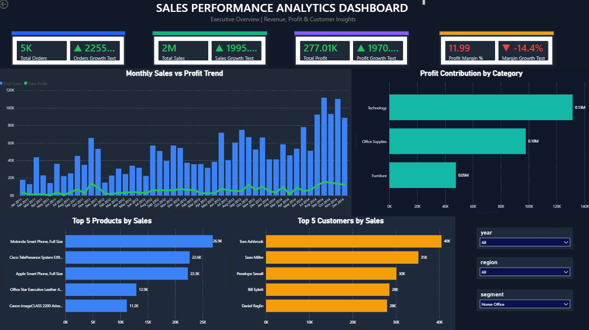

# 📊 Sales Performance Analytics Dashboard

An interactive Power BI dashboard built using the Superstore dataset to analyze sales, profit, customer behavior, and product performance. The project includes data cleaning, exploratory analysis, SQLite database integration, KPI tracking, and interactive filtering for business insights.

---

## 🚀 Project Overview

This dashboard helps stakeholders monitor:

- Revenue performance
- Profitability trends
- Customer contribution
- Product sales performance
- Category-wise profit contribution
- Month-over-Month KPI growth

The dashboard is fully interactive and supports dynamic filtering using slicers.

---

## 📈 Key Features

### Executive KPI Monitoring
- Total Orders
- Total Sales
- Total Profit
- Profit Margin %

### Growth Analytics
- Month-over-Month (MoM) Growth %
- Dynamic KPI tracking
- Conditional KPI indicators

### Sales Trend Analysis
- Monthly Sales Trend
- Monthly Profit Trend
- Combined Revenue vs Profit visualization

### Category Insights
- Profit Contribution by Category
- Category-level profitability comparison

### Product Insights
- Top 5 Products by Sales

### Customer Insights
- Top 5 Customers by Sales

### Interactive Filtering
- Year Filter
- Region Filter
- Segment Filter

---

## 🛠 Tech Stack

### Data Processing
- Python
- Pandas
- SQLite

### Data Visualization
- Power BI Desktop
- DAX Measures

### Development Tools
- Jupyter Notebook
- VS Code
- Git
- GitHub

---

## 📂 Project Structure

```text
sales-dashboard/
│
├── powerBI/
│   └── sales_analysis.pbix
│
├── notebook/
│   └── EDA.ipynb
│
├── script/
│   └── ingestion_db.py
│
├── screenshots/
│   ├── Dashboard.png
│   ├── 2_year_filter_demo.png
│   ├── 3_region_filter_demo.png
│   └── 4_segmentation_filter_demo.png
│
├── .gitignore
└── README.md
```

---

## 📸 Dashboard Preview

### Main Dashboard



---

### Year Filter Demo



---

### Region Filter Demo



---

### Segment Filter Demo



---

## 📊 Business Insights Generated

- Technology category generated the highest profit.
- Sales show a consistent upward trend across years.
- A small group of customers contributes significantly to revenue.
- Product performance varies considerably across categories.
- Profit growth does not always move proportionally with sales growth.

---

## ⚙️ Data Pipeline

1. Raw Superstore dataset loaded using Python.
2. Data cleaning and preprocessing performed with Pandas.
3. Processed data stored in SQLite database.
4. Exploratory Data Analysis completed in Jupyter Notebook.
5. Power BI connected to the database.
6. DAX measures created for KPI calculations.
7. Interactive dashboard developed for business reporting.

---

## 🎯 Skills Demonstrated

- Data Cleaning
- Exploratory Data Analysis (EDA)
- SQL & SQLite
- Data Modeling
- DAX
- Power BI Dashboard Development
- KPI Design
- Business Intelligence Reporting
- Data Storytelling

---

## 👤 Author

**Sundar Srihari**

GitHub: https://github.com/sundar-0311

---

⭐ If you found this project interesting, consider giving it a star.
